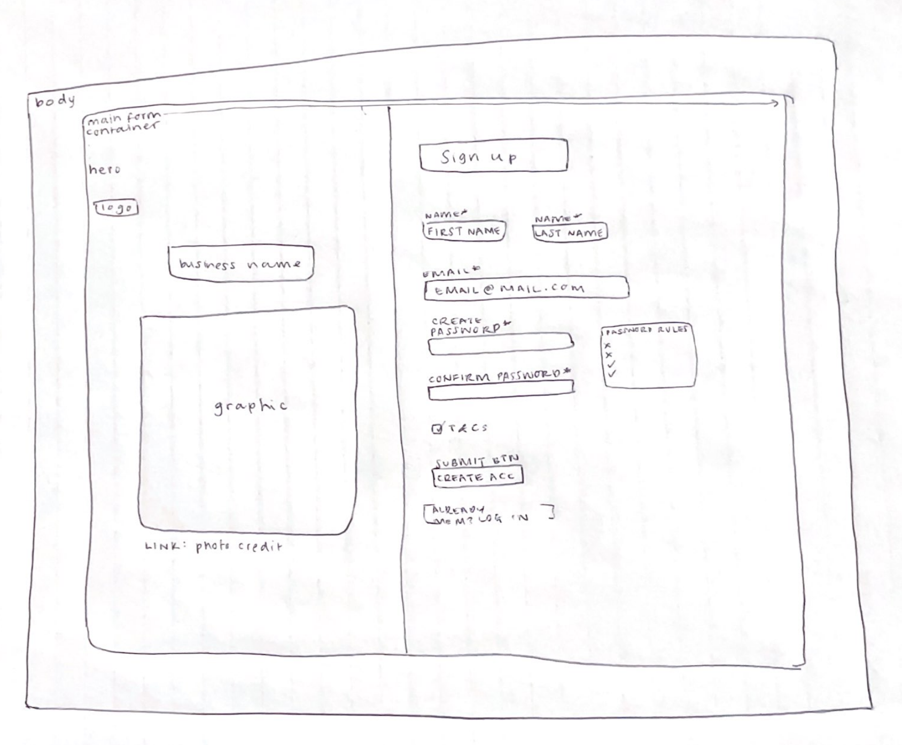
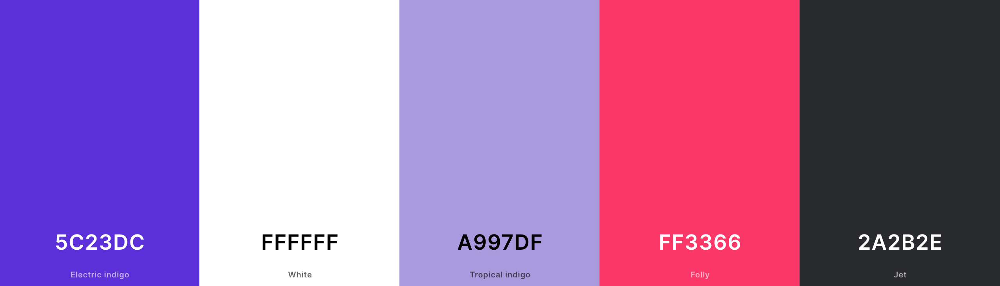

# Project Plan
This is my planning page for the Sign-up Form project from the Intermediate HTML and CSS Course at [The Odin Project](https://theodinproject.com/).

### Project Requirements

#### Step 1: Set up and planning
Download a full-resolution copy of the design file, and get a general idea for how you’re going to need to lay things out in your HTML document.

<strong>Provided design file</strong>

#### Step 2: Gather Assets
The design has a large background-image, so go find and download an image you want to use for that section. 

#### Step 3: Some Tips!
The other variation is the selected input, which should have a blue border and subtle box-shadow. This can be done with the :focus pseudo-class you’ve learned about in an earlier lesson.
Do not worry about making your project look nice on mobile, but DO resize your browser a little bit to make sure that it’s not completely broken at different desktop resolutions.
Checking that the password fields match each other requires javascript. Try to implement this if you feel confident, otherwise just validate each field separately.

## Plan

#### Features to implement
[x] password checking/confirmation match 
[] password strength checker? 
[] media query for small screens 
[] add "create account via google/facebook"
[] Add dashes to phone number input e.g. 123-456-789

##### Name ideas
* LinguaLink / LenguaLink
* LingoConnect
* Linguafy
* Idiomatica
* MetaLingua

### HTML
<strong>Elements: </strong>
* main form div that sits in the body
    * body background should be a pale grey
* <strong>left side hero image</strong>
    * logo/business name
    * text describing service (?)
    * photo attribution
* <strong>right side form</strong>
    * sign-up header
    * sign up with google or facebook (?) 
    * first name
    * last name
    * email
    * phone number
    * <strong>create password</strong>
        * <em>rules for password appear on click</em>
        * confirm password
    * submit/create account
    * terms and conditions
    * already a member? log in

<strong>Low-fidelty sketch of UI</strong>

### CSS and design
[] main form should have rounded corners
[x] <strong>colour palette</strong>
    * white: #FFFFFF
    * black: #2A2B2E
    * primary: #5C23DC
    * secondary: #A997DF
    * accent: #FF3366
    * green: #2CDA9D
    
[x] choose graphic 
    * 
[x] design logo 
[x] input focus mode accent colour
[] style form validation errors

#### Form Validation
[x] required fields > mark label with asterisk 
[x] password 
    * at least 6 characters
    * at least one uppercase charater
    * at least one number
    * at least one special character

### Javascript
